# REMOTE CONTROLLED ROVER FOR MONITORING AND ENVIRONMENT DETECTING

## Abstract
A remote controlled rover is usually a car-shaped robot which can be controlled wirelessly. It is widely used in outdoor adventure, scientific research, entertainment and other fields. Nowadays, the rovers in the market are mostly designed for entertainment. They usually have small appearances and flexible actions, which are convenient to operate and can be used in multiple environment. However, most of them can only be controlled by joysticks or specific APP and aren't equipped with enough sensors for monitoring and environment detecting. Therefore, in this project a rover equipped with several sensors and peripheral devices through PC control is designed to extend the limitation of the usage purpose. Based on the joint programming of Arduino and LabVIEW, an efficient bidirectional communication platform is built between the PC and the rover in this project, which has the capability to operate the rover from a remote location and monitor real time data collected by the sensors as well as storing the relevant information on the computer.

## Requirements

### Software packages
- OS: Arduino IDE 1.8.9, Labview 2017.
- Languages: C/C++, G Language.
- Dependancies:    
    - Arduino Libraries: esp_camera.h, esp_timer.h, img_converters.h, Arduino.h, fb_gfx.h, soc/soc.h, soc/rtc_cntl_reg.h, esp_http_server.h, SoftwareSerial.h, Servo.h, WiFi.h, Adafruit_Sensor.h, Adafruit_BMP085_U.h
    - Labview Packages: VAS (Vision Acquisition Software), VDM (Vision Development Module)
    - IP Camera Packages: IP Camera Bridge Master
### Hardware
- Core:
  - DFRduino RoMeo x 1
- Components:
  - Breadboard x 1
  - Arduino UNO shield x 1
  - HC-SR04 Ultrasonic Sensor x 1
  - KY-013 Temperature Sensor x 1
  - KY-016 RGB LED Module x 1
  - KY-052 Air Pressure Sensor x 1
  - HC-05 Bluetooth Module x 1
  - ESP32-CAM (ESP32 + OV2640 Camera) x 1
- Rover Frame:
  - Rover shell x 1
  - Servo x 1
  - DC motors x 2  
  - Wheels x 4

## Installation and setup
### Arduino
First we need to install the necessary software in our personal computer. For the Lower Computer System we will use Arduino IDE as the platform, which we can download here: [Arduino IDE download](https://www.arduino.cc/en/software). After we downloaded this software, we need to install some libraries for the future work. Arduino allows installation of third-party platform packages using Boards Manager. Here we need to configure the system so as to program the <a id="ESP32 camera">ESP32 camera</a>.
- Start Arduino and open Preferences window. The link to use in the "Preferences" of Arduino IDE for ESP32 board is https://dl.espressif.com/dl/package_esp32_index.json
- Open Boards Manager from Tools > Board menu and install esp32 platform
- Select ESP32 board from Tools > Board menu after installation. Here we need to select "ESP32 Wrover Module". With Upload Speed of "921600" (if you couldn't upload your code successfully, try to change this part into 115200), Flash Frequency of "80MHz", Flash Mode of "QIO" and Partition Scheme of "Huge APP".

For uploading the code to the ESP32 Camera, here we can use Arduino UNO directly as the bridge to connect between the ESP32 Camera and the PC (If we don't have FTDI). Here is the process to configure the ESP32 Camera by using Arduino UNO:
- Connect the GND and RESET port of the Arduino UNO with a jumper so as to ensure code won't upload to Arduino UNO but to ESP32 Camera.
- Before uploading the code, connect the GND and IO0 port of the ESP32 Camera with a jumper, and press the RST button on it (under powered).
- Click on Examples > ESP32 > Camera > CameraWebServer, to open an example.
- Remove the annotation before "# define CAMERA_MODEL_AI_THINKER"
- Change the ssid and password in the given example, remember the ESP32 Camera and our PC should link to the same LAN, so as to say we need to link to the same WIFI. And then upload the code.
- After finished uploading, remove the jumper and press the RST button again.
- Click on Tools > Serial Ports Monitor, to check the IP address and relevant information of the ESP32 Camera.

<p align="center">
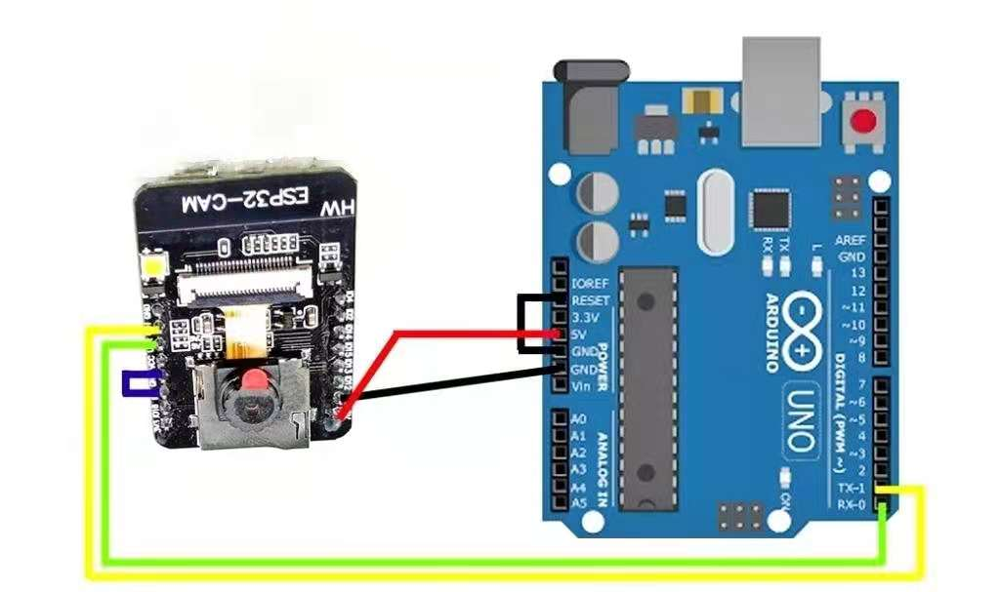

### LabVIEW
For the Upper Computer System we will use LabVIEW as the platform, which can be download here: [LabVIEW download](https://www.ni.com/fr-fr/support/downloads/software-products/download.labview.html#369482). Since we need to get the real-time stream of the camera, we need to install the relevant packages for supporting LabVIEW to get the images. Here we need to download two packages, VAS (Vision Acquisition Software) and VDM (Vision Development Module). VAS includes NI-IMAQ and NI-IMAQdx, which can be used to acquire images from different cameras. VDM is mainly used for image processing and machine vision.
 <p align="center"> 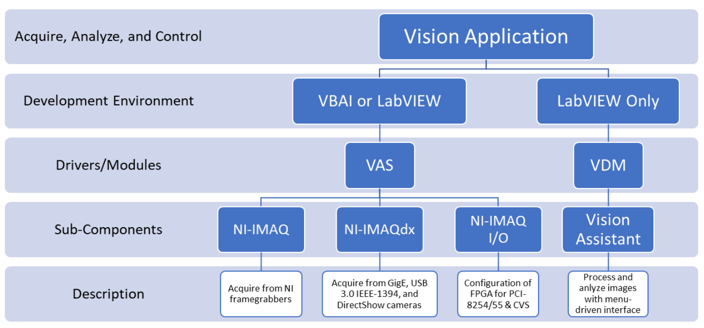

- Download VAS here: [VAS download address](http://visionbbs.com/forum.php?mod=viewthread&tid=21516&highlight=VAS).
-  Download VDM here:: [VDM download address](http://visionbbs.com/forum.php?mod=viewthread&tid=8487&highlight=VDM).
-  Restart the computer after installed successfully, open LabVIEW and we can see an additional function is added in the LabVIEW function list in the program panel: Functions > Vision and Motion.

<p align="center"> 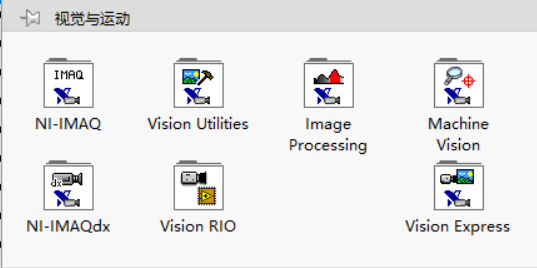

After finished the configuration relates to the camera of both Arduino and LabVIEW, now we need to convert the IP camera to a local one so that LabVIEW can detect it and show the real-time stream on the front panel. Therefore, we need to use an IP camera bridge to link the IP camera and our PC. Here is the link where we can download the IP camera bridge:  [ IP-Camera-Bridge-master](https://github.com/shenyaocn/IP-Camera-Bridge).
- Download this project and unzip.
- Go to folder "IPCameraBridge\x86" double click install.bat to install.
- Click YES when UAC prompted and a dialog name "IP Camera Bridge Property" will show. Fill in each blank with the IP Camera's url, user and password and click OK.

<p align="center">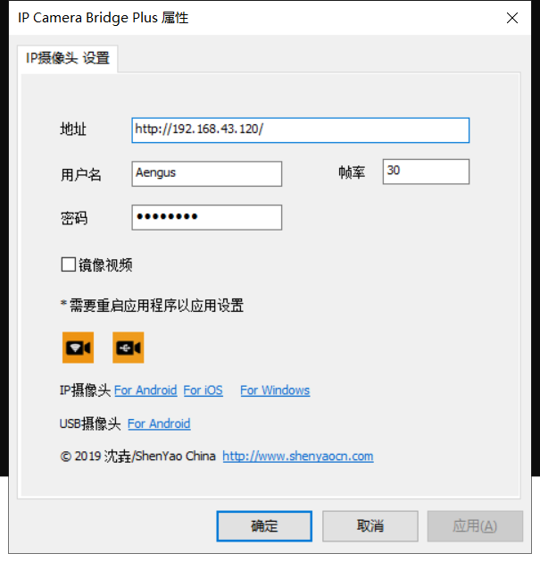

After set up the IP Camera Bridge, we can open our LabVIEW and check whether our PC can detect the IP camera. Go to Tools > Measurement & Automation Explorer > Equipment and Interfaces. If it has set up successfully, we can see a new camera has already added to our PC and can be detected by the LabVIEW. We can test whether our camera can work properly by clicking on the  "*Snap*" and "*Grab*" buttons.
<p align="center">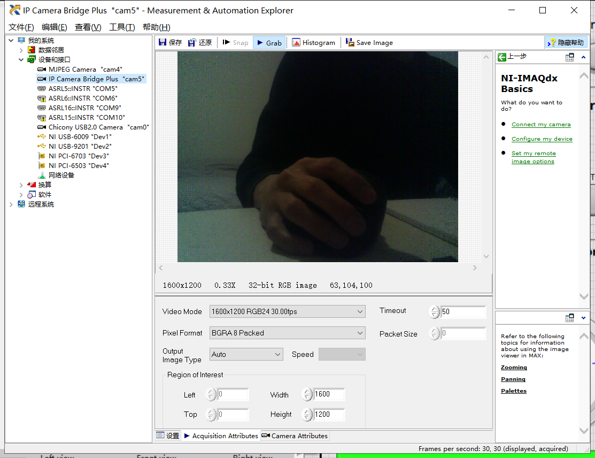

To set up the voice recognition module in LabVIEW, we need to open the [voice_learning.vi](https://github.com/AengusXC/Rover/blob/main/Labview_codes/voice_learning.vi) first and go to block diagram and change the .lvm file storage address in *Write To Measurement File* function. Then run the program and input the voice code that you want. After that we can find an .lvm file has already created in our chosen path.
<p align="center">
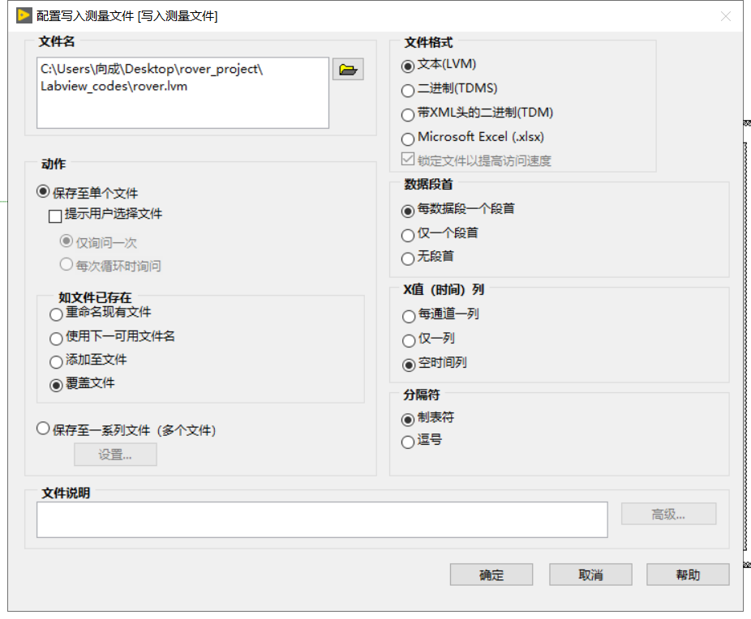

To detect whether the voice recognition function can work properly, we can open the [voice_recognition.vi](https://github.com/AengusXC/Rover/blob/main/Labview_codes/voice_recognition.vi), go to block diagram and input the .lvm file that we just created into the *Read From Measurement File* function. Run the program and test your voice code, if it matches the Boolean indicator "*Voice code indicator*" on the front panel will light up.
<p align="center">
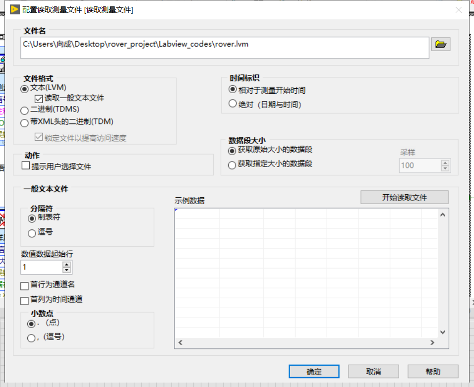

We can also detect it in the main LabVIEW code [Rover_main.vi](https://github.com/AengusXC/Rover/blob/main/Labview_codes/Rover_main.vi). First change the path of the .wav files. And then run the program, if your voice is recognized, you will hear "Rover is activated" from your computer's microphone, otherwise you will hear "Voice recognition failed".
<p align="center">
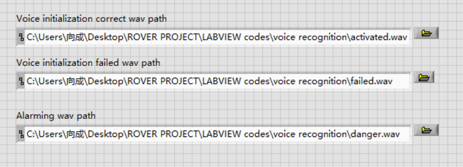

An additional function I added to the rover is <a id="machine vision">machine vision</a>. Which can be found in [Rover_mv](https://github.com/AengusXC/Rover/blob/main/Labview_codes/Rover_mv.vi). The learned pattern for tracking is a triangular object. If you want to change the pattern for tracking, then you need to activate the camera and run the program first, and make the pattern you want to track within the range of the camera. And then stop the program, go to block diagram and double click on the *Vision Assistant*, where a new window will pop up. Double click on *Pattern Matching 1* and chose *New pattern* to extract the pattern in the image that you want to learn.
<p align="center">
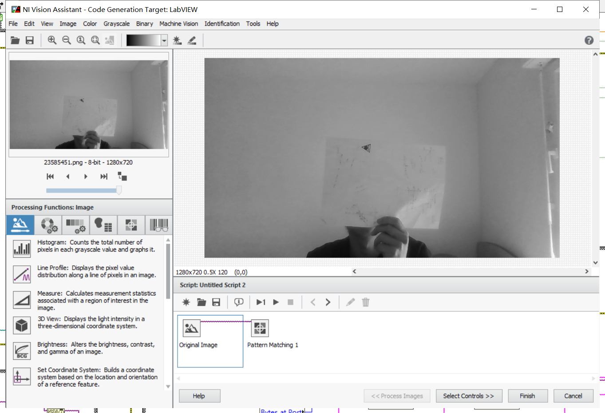

## Architecture
The proposed system can be divided into Upper Computer System  and Lower Computer System. The core of the upper part is a PC with LabVIEW platform. While for the lower part is a microcontroller unit, which will be placed and linked to the rover. In addition, to link between these two systems, Bluetooth and WiFi technology are implemented for building the bridges of communication. The core of control between the Upper Computer System and Lower Computer System is serial port communication. In the Lower Computer System, all the codes are pre-programmed into the microcontrollers and relevant control can be
achieved by checking the relevant string in the serial port.

### Upper Computer System
A LabVIEW platform is designed as the human-computer interface and will transmit commands to the Lower Computer System through the Bluetooth module in the PC. At the same time, the Upper Computer System will continuously receive the data collected by the sensors on the Lower Computer System, and will store the relevant information in *.xlm* format file on the local computer. In addition, in order to achieve real-time monitoring, the images stream captured by the camera on the Lower Computer System will be shown on the PC simultaneously and will be stored on local computer after finished running the program.

### Lower Computer System
The core of the Lower Computer System is the microcontroller unit, here a DFRduino RoMeo board is used as the main microcomputer. It serves both as a receiving end and a transmitting end. It receives the commands from the Upper Computer System through the inserted Bluetooth module on the board and gives relevant responses. At the same time, it collects the data from the sensors and peripheral devices and transmits the relevant information to the Upper Computer System. In addition, it connects to the ESP32 Camera, and the real-time images can be transmitted through WIFI to the Upper Computer System.

### System Overall Design
As shown in the Image below, the overall system is mainly composed of four parts: Electro-mechanical Module, Data Acquisition Module, Wireless Data Transmission Module and Power Supply Module. The Electro-mechanical Module builds the basic structure of the rover as well as providing the necessary hardware for controlling the DC motors and servo. The Data Acquisition Module consists of peripheral devices like temperature sensors, ultrasonic sensors, air pressure sensor, microphone, camera, etc. And the data acquired from these devices will go through the Wireless Data Transmission Module so as to be able to transmit between the Upper Computer System and the Lower Computer System. The Power Supply Module provides power to the DC motors and the microcontroller in the Lower Computer System.
<p align="center">
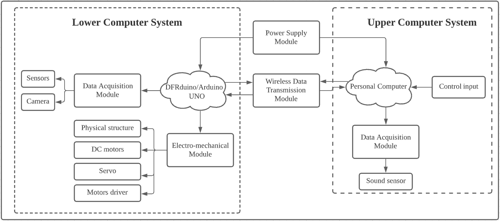


### Hardware Design
In order to drive the motors and servo, we need a microcontroller unit as well as two DC motor driver. In order to minimize size of hardware components as well as simplifying the mechanical structure. Here we use a DFRduino RoMeo board to satisfy both requires. It has already integrated 2 way DC motor driver and a wireless socket which is designed for robotics application. In addition, we will also use this circuit board to control all the sensors and peripheral devices, which will communicate with the Upper Computer System through Bluetooth directly. However, we may encounter a problem that if we use Bluetooth module on this circuit board, the TX and RX port will be occupied and we won't be able to program the ESP32 Camera with it. Thus, we need an additional microcontroller to program the camera (or we can program the camera in the first place), here we will use an Arduino UNO to do it. The hardware diagram is shown below. Because DFRduino RoMeo is compatible with Arduino UNO, so in reality we used an Arduino UNO shield with breadboard on it for better linking the components. In the diagram we can use an Arduino UNO board + DC motor driver to replace the function of DFRduino RoMeo.
<p align="center">
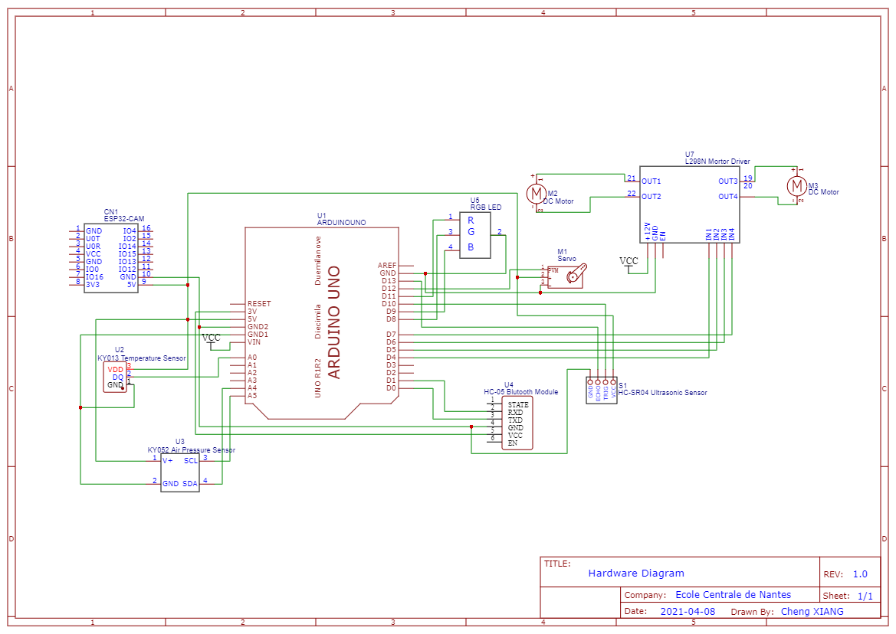

### Software Design
The software design can be divided into Arduino part and LabVIEW part, they correspond to the programs of the Lower Computer System and the Upper Computer System respectively.
#### Arduino Programming

The main idea of Arduino programming for the Lower Computer System is to assign specific character string to each control module, so that the Upper Computer System can control it through different keys. Besides the ESP32 Camera Control part, we can separate the Arduino programming into 4 parts, and we will check each of them through a case function in code in order to achieve the relevant control. While for the ESP32 Camera Control Module part, we only need to control the camera in order to transmit the images in appropriate resolution through WIFI to the Upper Computer System, which is done in a separate code fraction.
- Motors Control Module
  -  Stop module
  -  Advance module
  -  Retreat module
  -  Turn left module
  -  Turn right module
- Sensors Control Module
  - Temperature Sensor Module
  - Ultrasonic Sensor Module
  - Air Pressure Sensor Module
  - RGB LED Module
- Gear Control Module
- Servo Control Module
- ESP32 Camera Control Module

<p align="center">
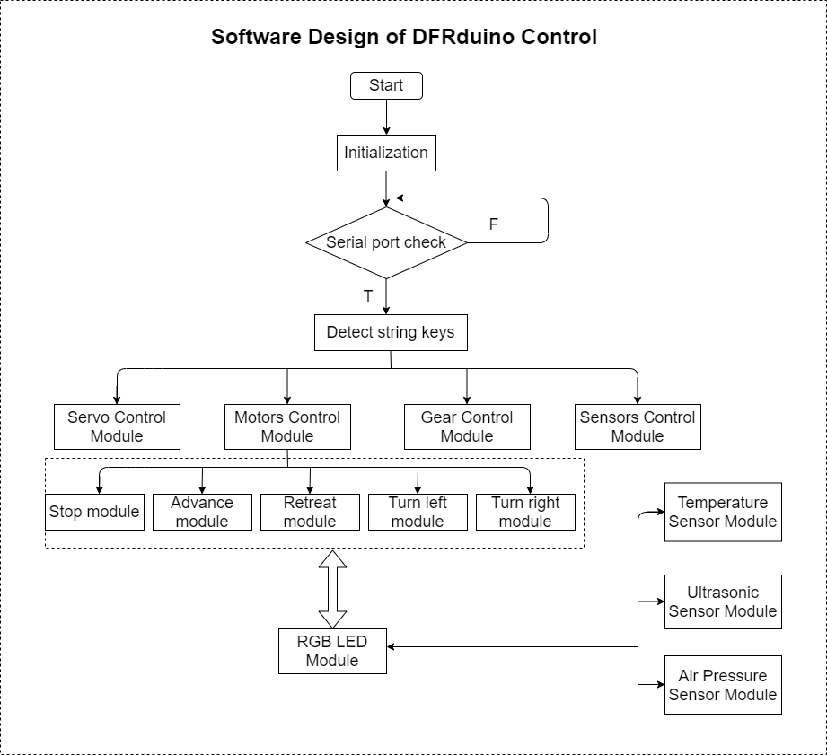
 <p align="center">
 

#### LabVIEW Programming

For LabVIEW programming, we need to achieve the control of the motors, servo, as well as the sensors and peripheral devices, so the main purpose is to write and check different strings that we have already programmed in the Lower Computer System through serial port. In addition, we need to store the relevant data from the sensors to an Excel format in our personal computer each time we activate the sensors. Moreover, the video stream captured by the camera should be stored to our personal computer each time we run the program. An additional function that I added to this program is voice recognition for initializing the whole program, which replaces the traditional user authentication process like inputting account and password. Therefore, we can separate the program into 4 parts generally.
- Movement Control Module
- Sensors Control and Data Storage Module
- Camera and Video Storage Module
- Voice Recognition Module

 <p align="center">
 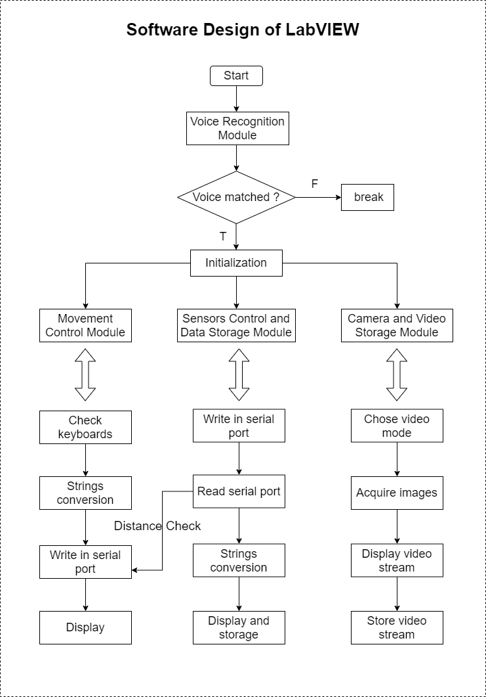

As shown in the figure below is the initialization part of the block diagram on LabVIEW platform. The program will execute backwards in a sequential structure. The first part is the voice recognition sub VI, where the input voice will be processed and compared with the standard voice in advance to determine whether the program continues to execute. If the voice recognition is successful, the program will go to the initialization part, which includes 5 sub-parts: Save video file configuration, Camera initialization, Excel format configuration, Serial port configuration and Keyboard configuration. The indicated number is shown in the figure.
<p align="center">
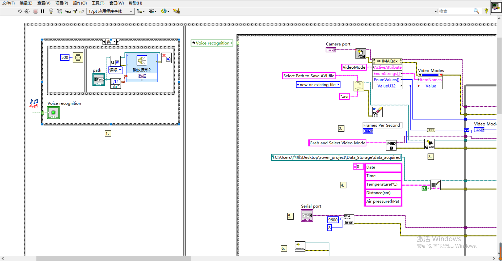

For the keyboard control module, it mainly consists of 3 parts: Get the keys and show relevant pressed keys on the front panel, Convert a 16-bit integer number into a hexadecimal string and Write the strings to the Serial port, which is shown in the figure below with relevant indicated number. Because the converted string type is in hexadecimal form, thus it can only represent 6 letters: from A to F. But we may need 7 keys to control the movement of 2 motors and one servo for turning in 3 angles. Therefore, in the Lower Computer System part we need to adjust the code for checking an alphabetic key and replace it with a number, and on the Upper Computer System, we only need to convert this alphabetic key to the relevant preset number.
<p align="center">
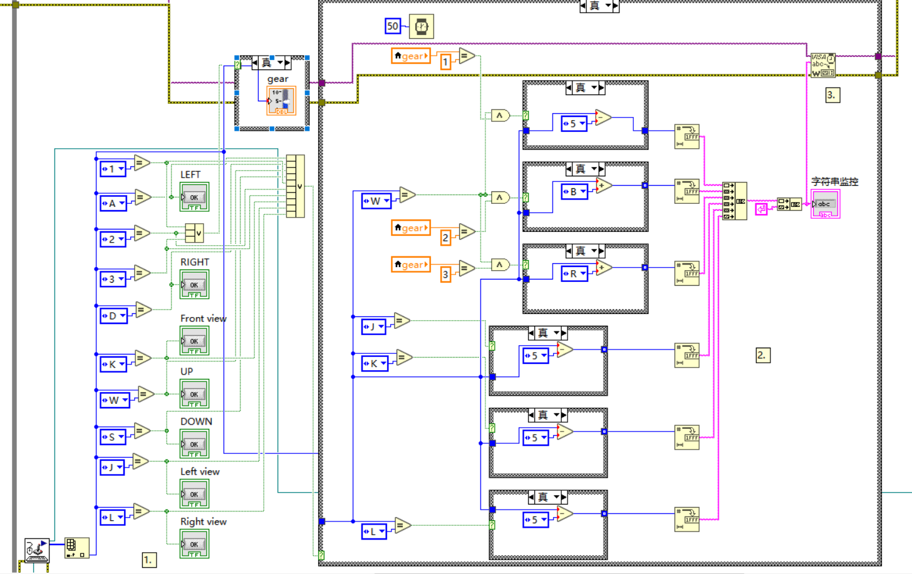

The sensors control and data storage module is shown in the figure below. It mainly consists of 10 parts, which is indicated in the figure below. The whole module is inside a conditional structure, if the sensor Boolean indicator in part 1 is true, the whole module will activate. And then the program will go to part 2 and 3, which is to write command to the serial port to get the temperature sensor data and demonstrate the temperature in Celsius on the front panel. The operation for part 4 and 5 is to write command to the serial port to get the ultrasonic sensor data and demonstrate the distance on the front panel. Part 6 is distance detection and obstacle avoidance part, the ultrasonic sensor data will compare with a certain number to calculate the distance in front of the rover, if the distance is too close, in the condition structure, a voice alarm will be executed, and the corresponding motor control key string will be passed into the Serial port in the form of negative feedback. While for part 7 and 8 is to write command to the serial port to get the air pressure sensor data and demonstrate it on the front panel. Part 9 is to classify the sensors data and write it into the Excel format file. At the end, part 10 is to close the Serial port, which is the end of Serial port control for motors, servo and sensors.
<p align="center">
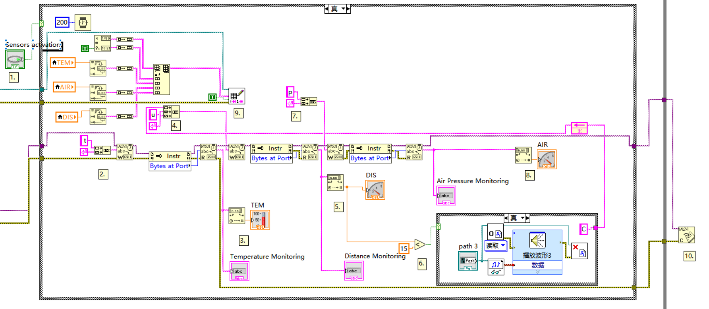

The last module is camera configuration and video saving module, which is shown in the figure below. It mainly consists of 5 parts, which is indicated in the figure. First is to clear the buffer of the camera and select the relevant video mode and configure the camera, the second part is to acquire the images. Part 3 is to save the relevant images into .avi format file, which can be considered as recording the video stream. Part 4 is to close the camera and part 5 is to end the recording of the video.
<p align="center">
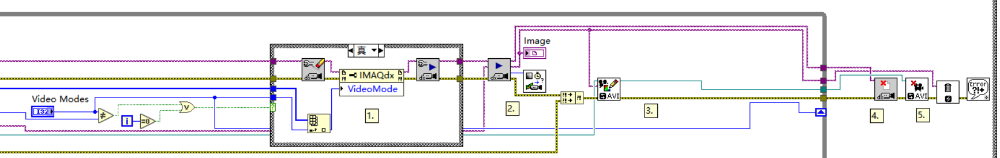

For the machine vision module that added in the [Rover_mv](https://github.com/AengusXC/Rover/blob/main/Labview_codes/Rover_mv.vi) can be seen in the figure above. It can be divided into 7 parts. The first part is camera configuration, and the second part is pattern searching function. Part three is getting the snapping wireframe, as well as the coordinate of the center of the pattern. Part four allows to indicate the pattern on the images with a red wireframe. In the part five, we can compare the coordinate of the pattern with the overall capture range of the camera, in order to adjust the position of the servo, which allows the camera to move accordingly in order to make the pattern righ in the middle of the capture range. And if the camera capture the pattern, you will hear "Object detected" from your PC's microphone. And part 7 allows to record the video as explained above.
<p align="center">
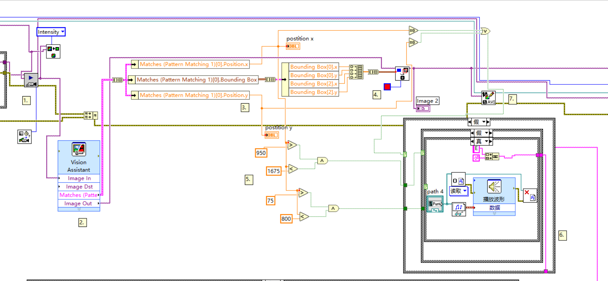


## Examples

Before running the whole project, we need to make sure that each of our component can work properly. So first of all we need to check the status of motors, servo, sensors and peripheral devices. We can detect and adjust their status individually in relevant example code, but it's a little time-consumming. Remember that we used a case function in the main code for controlling these components, so we only need to adjust the code in the loop function in order to achieve relevant control and detection through serial port monitor in Arduino IDE. So we can directly change the code in the [rover_control_sensor](https://github.com/AengusXC/Rover/tree/main/Arduino_codes/rover_control_sensors) part. Replace the loop function with the code given below:
```C++
void loop(void)
{
  if(Serial.available()>0)
 {
  char val = Serial.read();
  delay(2);
  if(val != -1)
    {
      switch(val)
      {
      case'1': gear_speed=150; //1 gear
       break;
      case'2': gear_speed=200; //2 gear
       break;
      case'3': gear_speed=255; //3 gear
       break;
      case 'W'://Move Forward
        advance ();  
        analogWrite(11, 0);  //R
        analogWrite(9, 255); //B
        analogWrite(8, 0);   //G
        //delay(20);       
        break;
      case 'S'://Move Backward
        back_off (255);   //move back in max speed
        analogWrite(11, 255);  //R
        analogWrite(9, 0);     //B
        analogWrite(8, 0);     //G
       // delay(20);
        break;
      case 'A'://Turn left
        turn_left (255);
        analogWrite(11, 255);  //R
        analogWrite(9, 255);  //B
        analogWrite(8, 255);  //G
       // delay(20);                
        break;
      case 'D'://Turn right
        turn_right (255);
        analogWrite(11, 255); //R
        analogWrite(9, 255); //B
        analogWrite(8, 255); //G
        //delay(20);           
        break;   
      case ' ':
        stop();
        analogWrite(11, 0);  //R
        analogWrite(9, 0);  //B
        analogWrite(8, 255);  //G
        break;
      case 'J' :     //Left view
         if(pos_check==90)
         {poser=0;
          Servo1.write(poser);
          analogWrite(11, 255);
          analogWrite(9, 0);
          analogWrite(8, 255);}
         else
         {poser -= 3; //than position of servo motor decreases by 3 (clockwise)
          Servo1.write(poser);
          analogWrite(11, 255);
          analogWrite(9, 0);
          analogWrite(8, 255);}
         delay(20);
         break;
      case 'K' :     //Front view
         Servo1.write(90);
         pos_check=90;
         analogWrite(11, 255);
         analogWrite(9, 0);
         analogWrite(8, 255);         
         break;   
      case 'L' :    // Right view
         if(pos_check==90)
         {poser=180;
          Servo1.write(poser);      
          analogWrite(11, 255);
          analogWrite(9, 0);
          analogWrite(8, 255);}
         else
         {poser += 3; //than position of servo motor increases by 3 ( anti clockwise)
          Servo1.write(poser);      
          analogWrite(11, 255);
          analogWrite(9, 0);
          analogWrite(8, 255);}
         delay(20);        
         break;
      case'u':
        digitalWrite(TrigPin, LOW);
        delayMicroseconds(2);
        digitalWrite(TrigPin, HIGH);
        delayMicroseconds(10);
        digitalWrite(TrigPin, LOW);
        distance = pulseIn(EchoPin, HIGH) / 58.00;
       // Serial.print("Distance: ");
        Serial.print(distance);
        Serial.print(" cm");
        Serial.println();
      //  delay(20);  
        break;
      case't':
        Vo = analogRead(ThermistorPin);
        R2 = R1 * (1023.0 / (float)Vo - 1.0); //calculate resistance on thermistor
        logR2 = log(R2);
        T = (1.0 / (c1 + c2*logR2 + c3*logR2*logR2*logR2)); // temperature in Kelvin
        T = T - 273.15; //convert Kelvin to Celcius
        // T = (T * 9.0)/ 5.0 + 32.0; //convert Celcius to Farenheit
        //Serial.print("Temperature: ");
        Serial.print(T);
        Serial.println(" C");
        //delay(20);  
        break;
      case'p':
        sensors_event_t event;
        BMPSensor.getEvent(&event);
        Serial.print(1000+event.pressure*10);
        Serial.println(" hPa");    
        break;
    }  
  }
 }
}
```
Before uploading the code, if we use USB bus to connect with the DFRduino board, we need to disconnect the TX and RX of Bluetooth Module on the board so as to be able to upload the code successfully (If not, the TX, RX is occupied by the Bluetooth Module and code won't be uploaded properly). After uploaded the code, we can click on Tools > Serial Ports Monitor, we can see a line of strings "*ROVER is ready !*" is printed on the display monitor and RGB LED on the board turns on and shows green light. When we type in  *W*, the rover won't move, but if we type in *W1* or *W2* or *W3*, the rover will move forwards in different speed and the RGB LED turns into blue color. If we type in *S*, it will go backwards and RGB LED turns red, while type in *A* and *D* will makes the front wheels turn left and right respectively and RGB LED shows white light. By typing in *J* or *L*, the servo will decrease/increase 3 degree from 90 degree respectively each time, and RGB LED turns into yellow color. If we press *'K'*, the servo will turn back to 90 degree, and after that if we press *J* or *L* each time, the servo will turn to 0 degree and 180 degree respectively. If we type in *u*, we can get the data from ultrasonic sensor, the relevant distance information will be printed in the display monitor. While when we type in *t* and *p*, we can get the data of temperature and air pressure. For detecting the status of ESP32 Camera, we can refer to the <a href="#ESP32 camera">ESP32 camera</a> part as mentioned above.

If the above situation can be satisfied, we can re-upload the original [rover_control_sensor](https://github.com/AengusXC/Rover/tree/main/Arduino_codes/rover_control_sensors) code to the DFRduino RoMeo, and then link the Bluetooth Module to the board. Open the main LabVIEW code [Rover_main.vi](https://github.com/AengusXC/Rover/blob/main/Labview_codes/Rover_main.vi), choose the right Serial port and Camera port on the front panel and run the program.
<p align="center">
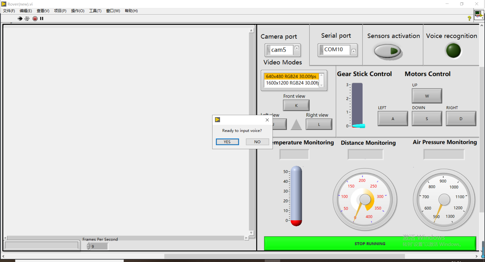

Click on YES and input the voice code, if successful, we will hear "Rover is activated" from the microphone and the "*Voice recognition*" boolean will turn into green color, at the same time, a pop-up window will appear which allows us to select a path to save the video stream.
<p align="center">
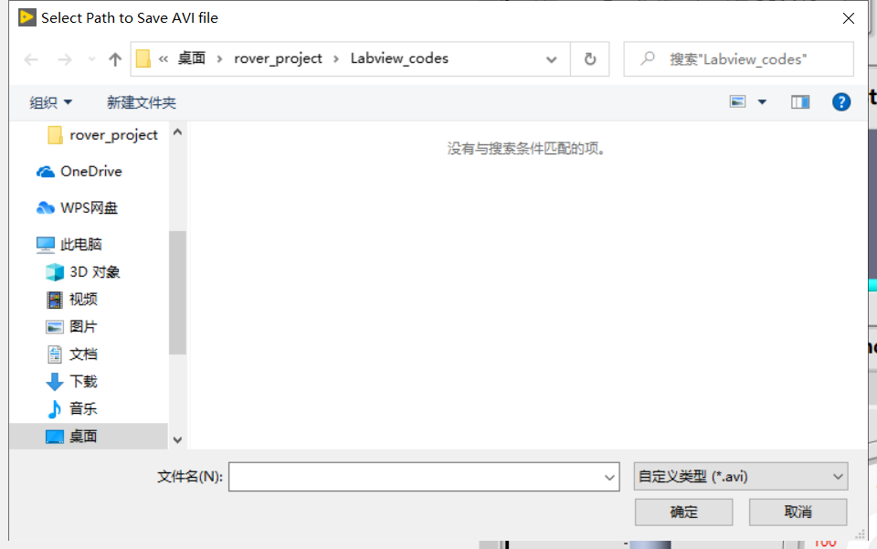

After selected the path, the whole program will run and we will see the RGB LED on the rover turns on and shows in green color, at the same time, real-time video stream starts to show on the left part of the front panel. Choose the right Video Mode in order to show the adapted resolution. Press *1 2 3* to set the gear, and *W A S D* to control the movements of the motors. *J K L* keys will control the servo and turn the camera around within 0 and 180 degrees. And once the relevant key is pressed, the according boolean will turn into green color on the front panel. Click on "*Sensors activation*" boolean, we can activate the sensors and we will see the relevant data will be demonstrated on the front panel.
<p align="center">
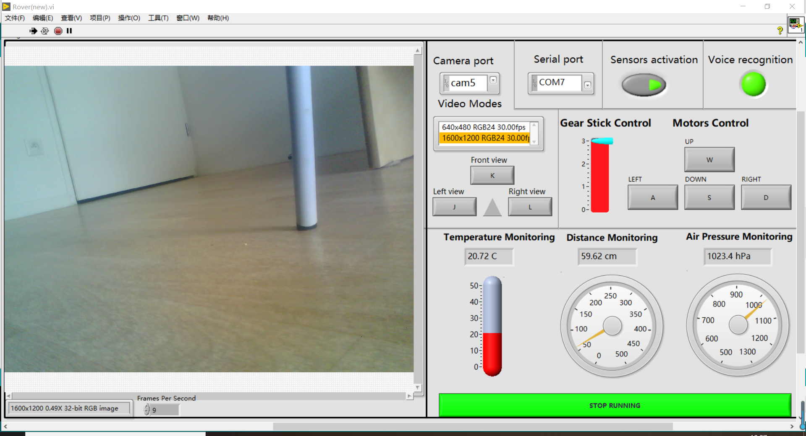

And after running the program we can find two files have already created in the [Data_storage](https://github.com/AengusXC/Rover/tree/main/Data_storage), one is an Excel file that stores the data of the sensors, the other is an .wav format file that stores the video stream.
<p align="center">
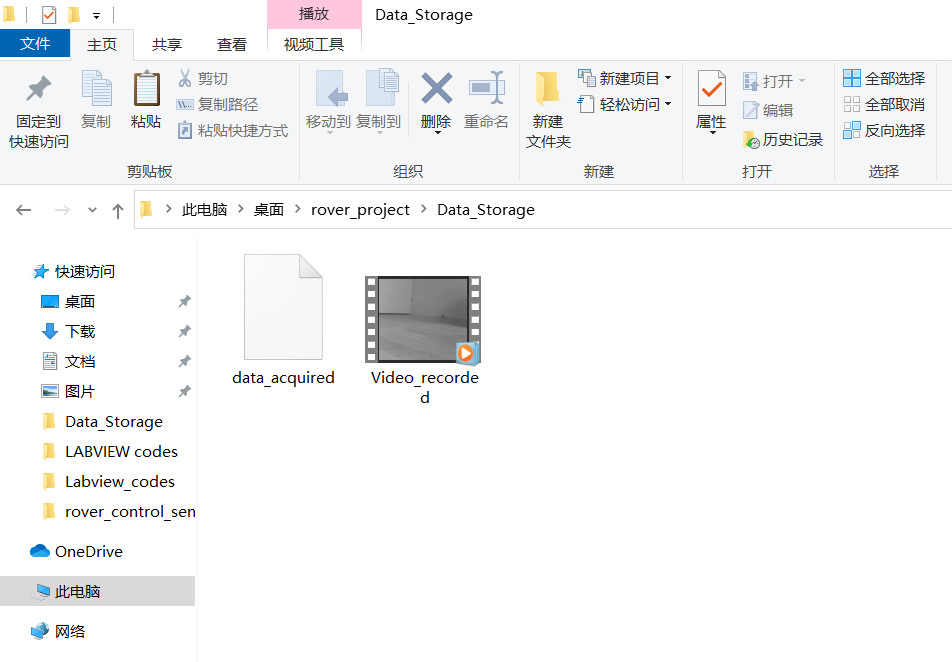

The stored sensors data would be like this:
<p align="center">
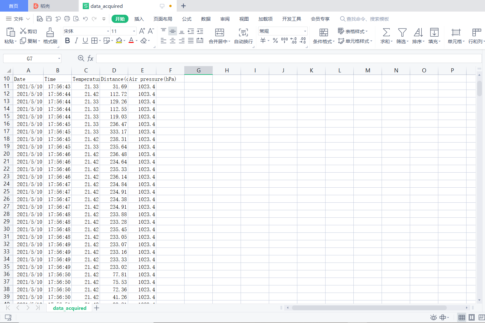

The machine vision function can be find on another vi [Rover_mv](https://github.com/AengusXC/Rover/blob/main/Labview_codes/Rover_mv.vi), because for the pattern matching function in LabVIEW Vision, the processed images should be in grayscale. In this way the recorded video would be in grayscale too. In this vi I removed the voice recognition part, so it would be easier to configure. As shown in the image, the camera will try to find the pattern and mark it with a red rectangle, the relavant coordinate would be shown on the front panel with *position x* and *position y* , and the servo will move accordingly in order to make the pattern in the middle of the image. To change the pattern for tracking, we can refer to the <a href="#machine vision">machine vision</a> part.
<p align="center">
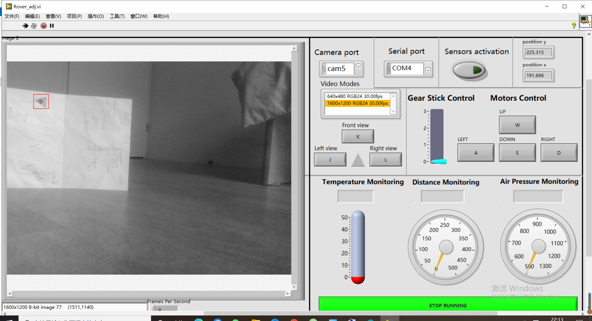

## Conclusion
The test results show that the graphical programming language LabVIEW can easily realize the video transmission between Upper Computer System and Lower Computer System. The wireless environment monitoring system of the intelligent detection rover is designed and developed with a single-chip microcomputer as the core processor and wireless Bluetooth and WiFi as the main means of communication. And it can transmit the images taken by the camera and the data of environmental temperature, distance, air pressure to the Upper Computer for storage and display in real-time. The detection rover can replace manual work in tunnel detection, rescue, search and arrest, mine clearance, radiation and other harmful and dangerous occasions by adding various sensors, and has broad application prospects.
